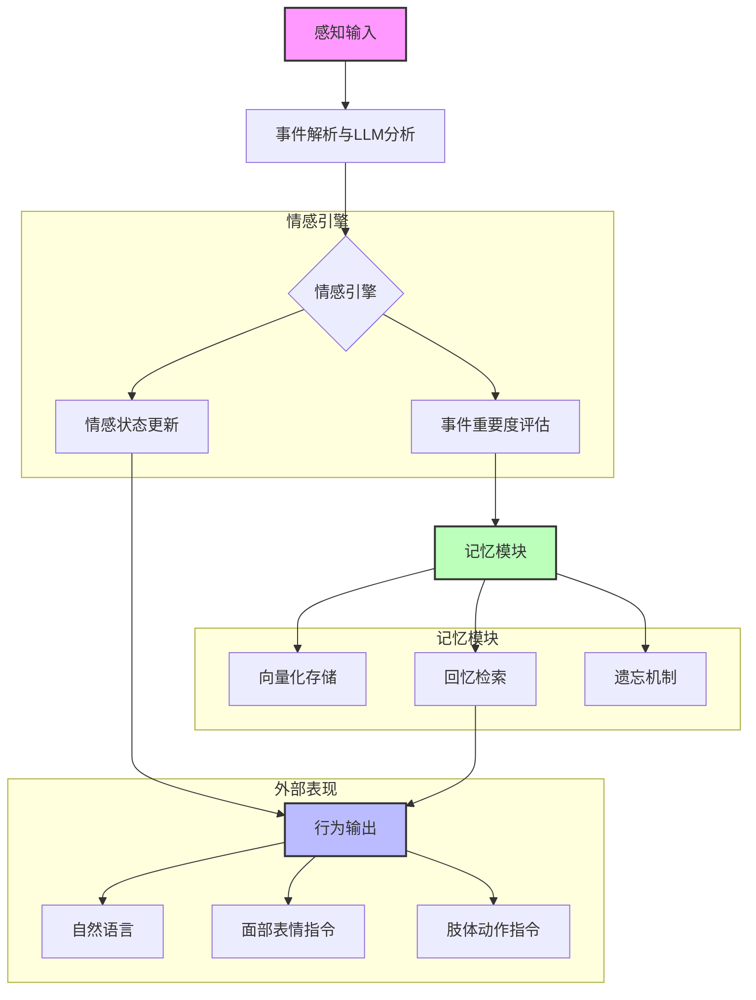
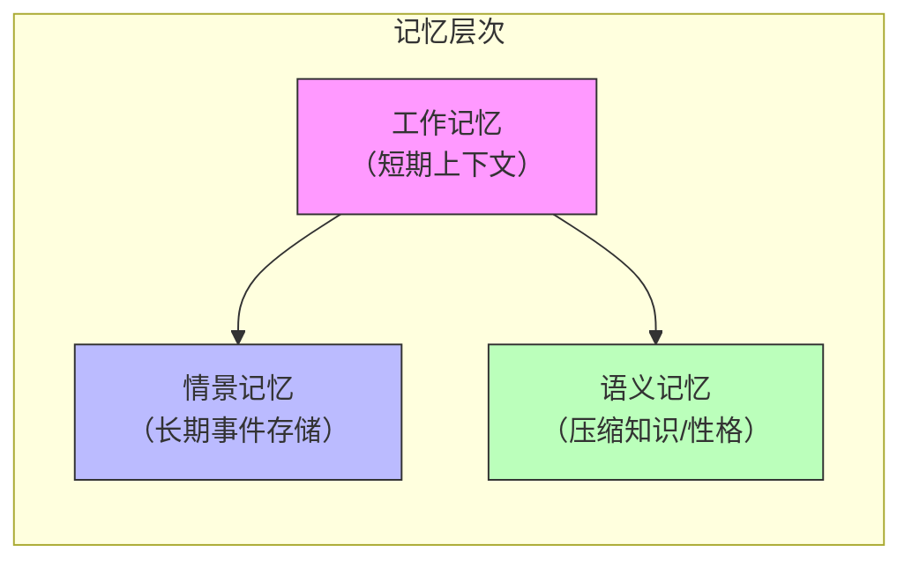

# AI-emotional-companionship

# EmotionAI: 基于大语言模型的情感智能体
作为AI时代的畅想
其中使用AI等进行完成自己对AI陪伴模型的想象。

## 📖 项目简介

**EmotionAI** 是一个融合了大语言模型（LLM）、情感计算与记忆机制的智能体框架。它旨在模拟人类的情感反应、事件判断和记忆过程，使人工智能体能够根据环境事件产生自然、连贯且个性化的情感行为。本项目不仅关注算法设计，还考虑了未来与实体机器人、屏幕显示等硬件的集成，为实现真正具有“人性”的AI助手提供基础。

不同于传统的一问一答式聊天机器人，我们希望打造一个像真人朋友一样“**活起来**”的AI伙伴——它会记住我们的过往、感受我们的情绪，并在恰当的时候主动关心我们。

**核心思想**：不是简单的if-then规则，而是利用LLM的语义理解和生成能力，结合动态情感状态和长期记忆，让AI体像人一样“感受”和“回忆”。

---

## 🧠 核心理念

- **从被动到主动**：打破“用户说一句，AI回一句”的模式，让AI能够感知对话节奏、主动发起话题、甚至根据用户情绪状态进行关怀。
- **记忆即灵魂**：让AI拥有持续成长的记忆系统，既能记住长期交互的细节，也能合理遗忘，模仿人类的记忆机制。
- **情感是温度**：赋予AI理解和表达情感的能力，使其回复不仅有内容，更有情绪色彩，让交互充满温度。

---

## 🗺️ 系统架构

下图展示了EmotionAI的整体结构及核心模块关系。

### 模块说明

| 模块 | 功能 | 技术要点 |
|------|------|----------|
| **感知输入** | 接收外部事件（文本、传感器数据、用户指令等），统一封装为事件对象。 | 可扩展多模态输入，未来可对接摄像头、麦克风等。 |
| **事件解析与LLM分析** | 使用大语言模型分析事件，输出情感变化向量、事件重要度、情感标签。 | 采用结构化提示（如JSON输出），确保结果可解析。 |
| **情感引擎** | 维护当前情感状态，根据LLM分析结果更新情感，并应用自然衰减。 | 情感维度可选择PAD（愉悦-激活-支配）或离散情感（快乐、悲伤等）。 |
| **记忆模块** | - **存储**：将重要事件向量化存入长期记忆。 - **检索**：根据当前事件向量召回相关记忆。 - **遗忘**：基于时间衰减和回忆次数，模拟遗忘曲线。 | 使用嵌入模型（如OpenAI Ada-002）生成向量，余弦相似度检索。 |
| **行为输出** | 结合情感状态和检索到的记忆，由LLM生成自然语言回应，并输出表情/动作控制指令。 | 可生成结构化指令供硬件解析（如屏幕显示表情参数、机器人动作序列）。 |

---

## 💡 核心模块详解

### 1. 主动对话引擎

传统对话系统采用严格的“一问一答”半双工模式，而EmotionAI实现了**全双工交互**，让AI能够：

- **流式预测与决策**：在用户说话过程中就开始理解语义，判断何时插话、何时倾听。
- **目标导向对话规划**：AI可以围绕某个目标（如了解用户近况、分享趣事）主动引导话题，而非完全跟随用户。
- **状态机管理**：根据对话阶段和用户情感，切换不同对话模式（日常闲聊、情感关怀、知识问答等）。

### 2. 情感计算单元

情感模块让AI具备“共情”能力，包含三个子功能：

- **情感识别**：分析用户输入文本（未来可扩展语音语调、面部表情）判断用户当前情绪（如快乐、悲伤、愤怒）。
- **情感状态维护**：AI自身维护一个情感向量（如PAD三维模型），每次交互后根据事件和用户情绪更新。
- **情感生成**：在生成回复时，结合自身情感状态和对话目标，选择富有情感色彩的措辞和语气，使回复更自然。

#### 情感模型：PAD三维情感空间

我们采用 **PAD 情感模型**（Pleasure-Arousal-Dominance）作为情感的基础表示：

- **愉悦度 (Pleasure)**：表示情绪的正负性，范围[-1, 1]。正值为愉快，负值为不愉快。
- **激活度 (Arousal)**：表示情绪的生理激活水平，范围[-1, 1]。高值表示兴奋、警觉，低值表示平静、疲惫。
- **支配度 (Dominance)**：表示个体对情境的控制感，范围[-1, 1]。高值表示主导、有控制力，低值表示顺从、受控。

**为什么选择PAD？**  
PAD模型能够连续、细腻地描述情感状态，比离散情感更灵活，且与LLM的分析兼容（可以通过自然语言提示让LLM输出ΔP值）。

**情感更新公式**：  
\[
E_{new} = \text{clamp}(E_{old} + \Delta E \cdot \text{personality\_factor} - \text{decay} \cdot E_{old})
\]
其中：
- \(\Delta E\) 由LLM根据事件分析得出。
- `personality_factor` 根据性格参数（如外向性、神经质）调整ΔE的幅度（例如神经质高的人对负面事件反应更强烈）。
- `decay` 为衰减系数，模拟情感随时间回归中性。

### 3. 记忆管理系统

记忆是AI个性化的核心。我们模仿人脑的记忆机制，构建了分层记忆架构：

| 记忆类型 | 技术实现 | 作用 |
|---------|----------|------|
| **工作记忆** | 滑动窗口（保留最近N轮对话） | 保证当前对话的连贯性 |
| **情景记忆** | 向量数据库 + 摘要压缩 | 存储跨会话的重要信息，支持语义检索 |
| **语义记忆** | 定期对情景记忆进行摘要（LLM生成） | 作为模型的“长期个性设定”，稳定行为风格 |

#### 存储与检索
- **存储时机**：只有当事件重要度超过阈值（如0.6）时，才存入长期记忆，避免信息爆炸。
- **向量表示**：事件文本通过嵌入模型转换为向量，用于后续相似度检索。
- **回忆触发**：当新事件与某条记忆的向量相似度超过阈值时，自动召回该记忆，影响当前情感和响应。

#### 难忘程度与遗忘机制
- **难忘程度计算**：结合事件重要度、情感变化幅度、回忆次数，决定记忆的持久性。公式：
  \[
  \text{memorability} = \alpha \cdot \text{importance} + \beta \cdot \Delta E_{\text{mag}} + \gamma \cdot \text{recall\_count}
  \]
  其中\(\Delta E_{\text{mag}}\)为情感变化向量模长，\(\alpha,\beta,\gamma\)为权重。
- **遗忘机制**：定期扫描记忆库，根据时间衰减和难忘程度移除低于阈值的记忆。衰减公式：
  \[
  \text{current\_memorability} = \text{initial\_memorability} \cdot \lambda^{\text{days\_passed}} \cdot (1 + \eta \cdot \text{recall\_count})
  \]
  其中\(\lambda\)为衰减因子（如0.9），\(\eta\)为回忆强化系数。这模拟了人类记忆的自然遗忘与复习强化规律。
- **记忆合并**：对向量空间中距离相近的多个事件进行聚类，由LLM生成摘要作为一条新记忆，减少存储冗余。

#### 情绪波动与情感上升
当事件引发的情感变化幅度较大时，系统会判定情绪波动级别（轻微/中等/强烈），并可能触发“情感上升”机制——即情感状态向极端方向强化，使AI的反应更具感染力。这一机制与事件重要度和记忆难忘程度相互影响。

### 4. 行为生成：情感与记忆的融合

行为输出由LLM根据以下上下文生成：

- **当前情感状态**（以文本描述或数值形式给出）
- **人物性格设定**
- **检索到的相关记忆**（如“你曾经历过类似事件，当时你感到……”）
- **用户当前输入**

LLM被要求生成自然、符合情感状态的回应，并可额外输出表情/动作指令（如`[smile:0.8]`、`[wave]`），供前端或硬件解析。

---

## 🔧 挑战与解决方案：克服上下文遗忘与Token限制

在大语言模型的实际应用中，两个核心工程挑战长期存在：

- **上下文遗忘**：模型无法记住早期对话细节，导致交互不连贯。
- **Token长度限制**：每次请求的输入有最大长度，无法无限携带历史对话，且长上下文会显著增加成本。

EmotionAI 通过内置的**分层记忆与检索增强生成（RAG）**机制，从架构层面有效缓解了上述挑战。

### 动态上下文构建策略

每次请求时，EmotionAI 会按优先级动态组合以下内容，精确控制总token数：

1. **系统提示**（含性格、语义记忆摘要）→ 约200 token
2. **检索到的情景记忆**（Top K条，每条约50-100 token）→ K × 100 token
3. **工作记忆**（最近N条对话）→ N × 50 token
4. **当前用户输入** → 可变

通过调整K和N，可灵活适应不同模型的上下文窗口限制。例如，对于4K上下文模型，可设置K=3，N=5，确保总token在安全范围内。

### 情感状态作为压缩表征

情感向量（PAD值）是对过去一段时间情感状态的浓缩表示。每次请求时携带当前情感值，模型即可推断出大致心境，无需详细描述情绪变化过程，进一步节省上下文空间。

### 与传统方案的对比

| 方案 | 优点 | 缺点 |
|------|------|------|
| 无限上下文模型 | 简单，无需额外设计 | 成本高，仍受窗口限制，早期信息被稀释 |
| 纯规则摘要 | 可控 | 丢失细节，手工维护复杂 |
| **EmotionAI分层记忆** | **低成本，保留关键细节，符合人类记忆规律，可扩展** | **需额外维护向量检索模块** |

---

## 🖥️ 外部交互与物理形态

EmotionAI 不仅是一个软件框架，更是一个可嵌入物理世界的智能体。我们设计了多种与外部环境交互的方式，使AI能够感知现实、表达情感，并根据硬件条件灵活适配。

### 1. 物理形态选择

- **便携式机器人**：小型可移动载体，具备肢体动作展示能力，适合家庭拜访或随身陪伴。通过舵机实现简单肢体语言（如挥手、点头），并可通过小屏幕显示面部表情（暂不成熟时可先用LED矩阵或简单图标）。
- **独立屏幕显示**：将AI整体投射到屏幕上，显示完整的躯体数据可视化（如心率波动、情感曲线），并拥有丰富的面部表情和语言语气。适用于固定场景，如智能家居中枢。
- **混合形态**：机器人 + 屏幕组合，机器人负责移动和肢体动作，屏幕展示精细表情和数据可视化。

### 2. 感知层：接收外部刺激

- **传感器输入**：可集成摄像头（人脸表情识别、物体检测）、麦克风（语音情感识别）、触觉传感器等，将物理信号转化为事件。
- **现实场景适配**：支持“可便携携带”和“家庭拜访”两种模式，根据位置变化调整行为（如在家庭环境中更注重陪伴，在外出时更关注安全提醒）。

### 3. 表现层：情感的外在表达

- **面部表情模块**：通过小屏幕或投影显示表情，情感状态（PAD值）映射到面部肌肉参数（如眉眼角度、嘴型），实现细腻的情绪传递。
- **肢体动作展示**：根据情感激活度（Arousal）和事件类型，生成动作指令（如高兴时跳跃、悲伤时低头），由机器人执行。
- **躯体数据可视化**：在屏幕上实时显示情感曲线、记忆热度图、当前情绪标签等，增强交互的透明感和科技感。
- **语音语气**：结合情感状态调整语音合成参数（语速、音调、音量），让声音富有情感色彩。

### 4. 技术支撑

- **3D建模与渲染**：使用3D建模软件（如Blender）设计人物外形，并通过3D转2D显示技术（如Unity、Three.js）在屏幕上呈现。
- **前端可视化**：基于Web技术（如D3.js、Three.js）实现数据表情动作的实时可视化，提供可交互界面。
- **后端处理**：负责数据保存（记忆存储）、大模型调用、传感器数据融合，可采用FastAPI或Flask提供API。
- **大模型训练与装载**：针对特定人物外形和交互场景，对基础LLM进行微调（如LoRA），使其语言风格与外形一致。模型可部署在云端服务器中心，或通过边缘计算设备（如Jetson）本地运行。
- **联网能力**：支持云端协同，获取实时信息（如天气、新闻），丰富对话内容。

通过以上设计，EmotionAI 能够根据现实事件（如突然的惊喜）动态模拟情感、判断回应方式，并通过多种物理形态与用户产生有温度的互动。

---

## 🛠️ 技术栈概览

- **大语言模型**：OpenAI GPT系列 / 本地部署模型（如LLaMA、ChatGLM、Qwen）
- **嵌入模型**：OpenAI Ada-002 / 开源模型（如BGE、Sentence-BERT）
- **向量检索**：FAISS / Chroma / 简单numpy实现
- **后端框架**：Python (FastAPI/Flask) 提供API服务
- **前端/硬件接口**：WebSocket / ROS / 串口通信
- **数据存储**：SQLite / Redis（用于短期记忆）
- **3D/2D可视化**：Three.js / Unity / D3.js
- **机器人控制**：ROS / Arduino / 舵机驱动库

---

## 🚀 未来发展方向

- **多模态感知**：集成视觉（表情识别）、听觉（语音情感识别），使事件输入更丰富。
- **语音交互**：集成 Whisper（ASR）和 ChatTTS / Edge-TTS，实现真正的语音对话。
- **虚拟形象/机器人**：将情感状态映射到3D虚拟形象的面部表情或实体机器人的动作。
- **长期个性化**：通过强化学习微调情感参数，使AI体适应用户偏好。
- **群体情感模拟**：多个AI体之间的情感感染与社交互动。
- **伦理与可控性**：研究情感AI的安全边界，确保行为符合人类价值观。

---

## 🤝 如何贡献

我们欢迎对情感计算、LLM应用、机器人技术感兴趣的开发者参与。您可以通过以下方式贡献：

- 提交 Issue 报告问题或提出新想法。
- Fork 项目并提交 Pull Request 改进代码或文档。
- 参与讨论，分享您的应用场景。

---

## 📄 许可证

本项目采用 MIT 许可证，详情请参见 [LICENSE](LICENSE) 文件。

---

**EmotionAI** —— 让机器拥有情感的温度，不止于智能。
